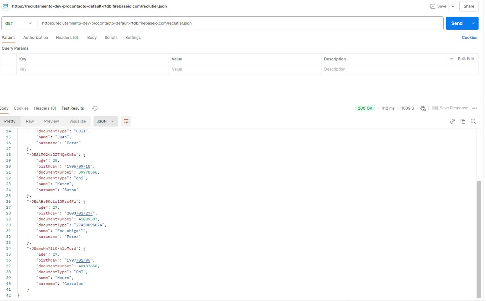

# Trabajo Práctico

# Teoría

### Preguntas generales sobre HTTP/HTTPS

- ¿Qué es HTTP y cuál es su función principal?
    
    HTTP es un protocolo para la transmisión de información.
    
- ¿Cuál es la diferencia entre HTTP y HTTPS?
    
    La diferencia entre HTTP y HTTPS es que **HTTP** transmite información en plano, es decir sin cifrado, por el contrario, **HTTPS** es un protocolo para transmisión de información cifrada.
    
- ¿Cómo funciona el proceso de cifrado en HTTPS?
    
    El proceso de cifrado en HTTPS funciona utilizando certificado SSL/TLS siguiendo los siguientes pasos:
    
1. En primer lugar, cuando el cliente realiza una solicitud https, el servidor responde enviando su certificado digital (donde se encuentra la clave pública).
2. Luego, el cliente verifica que el certificado sea válido y crea una clave, donde usa la clave pública del certificado para cifrarla
3. Finalmente, el servidor descifra la clave enviada por el cliente con su clave privada, estableciendo así una conexión cliente-servidor donde cifran todos los datos que intercambian.

- ¿Qué es un certificado SSL/TLS y cuál es su importancia en HTTPS?
    
    Como se menciona en el punto anterior, un certificado SSL/TLS es utilizado para cifrar la comunicación, autenticar al servidor y asegurar que los datos no fueron manipulados en la comunicación HTTPS.
    Cabe destacar que el problema que tenía SSL, es que en el proceso de handshaking había formas de atacarlo para que en lugar de que el cliente y el servidor se pusieran de acuerdo y utilizaran los algoritmos mas robustos, se podía forzar a que bajo ciertas circunstancias, se eligieran algoritmos mas viejos o menos robustos que eran fáciles de romper, por lo que cuando apareció **TLS**, ésta buscó reemplazar y romper la compatibilidad con SSL siendo más robusto y flexible incorporando protección frente a ataques que intentaran forzar el uso de versiones antiguas o cifrados más débiles.
    

- ¿Qué es un método HTTP? ¿Podrías enumerar algunos de los más utilizados?
HTTP es un protocolo para la transmisión de información siendo los más utilizados **GET**, **POST**, **PUT** y **DELETE.**

- Explica las diferencias entre los métodos HTTP GET y POST.
Las diferencias son que el método **GET** se utiliza para solicitar información al servidor mientras que el método **POST** se utiliza para enviar datos al servidor

- ¿Qué es un código de estado HTTP? ¿Podrías mencionar algunos de los más comunes y lo que significan?
    
    Un código de estado HTTP es un número que devuelve el servidor como parte de una respuesta a una solicitud HTTP indicando el resultado de la misma. Algunos de los más comunes son:
    
    - 200: OK (Solicitud exitosa)
    - 201 Created (Creado con éxito)
    - 400: Bad request (La solicitud tiene errores de formato)
    - 404: Not found (No se encuentra en el servidor)
    - 502: Bad Gateway (Error de comunicación entre servidores)
    
- ¿Qué es una cabecera HTTP? Da ejemplos de cabeceras comunes.
    
    Una cabecera HTTP es información adicional que se envía en una solicitud o respuesta HTTP, las cabeceras se dividen en dos tipos principales: **Request headers** y **Response headers**, siendo las mas comunes**:**
    
    - Content-Type
    - Content-Length
    - Authorization
    
- ¿En que consiste el concepto de “idempotencia” en los métodos HTTP? ¿Qué métodos cumplen con esta característica?
    
    En los métodos HTTP el concepto de idempotencia consiste en que cuando una solicitud es repetida varias veces, ésta sigue produciendo el mismo resultado, es decir que no cambia el estado del servidor más allá de la primera ejecución.
    
    Los métodos que cumplen con esta característica son **GET**, **PUT** y **DELETE.**
    

- ¿Qué es un redirect (redirección) HTTP y cuándo es utilizado?
Un redirect es un mecanismo que le permite al servidor indicarle al cliente que la URL solicitada ha cambiado y que debe hacer una nueva solicitud a una URL diferente.
    
    Las redirecciones se utilizan por ejemplo: 
    
    - Cuando hay un cambio de dirección de un sitio web
    - Redirección de HTTP a HTTPS
    - Redirección luego del envío de una solicitud POST
    - Redirección temporal en casos de páginas en mantenimiento
    

### Preguntas técnicas y de seguridad en HTTP/HTTPS

- ¿Cómo se asegura la integridad de los datos en una conexión HTTPS?
    
    En una conexión HTTPS la integridad de los datos se asegura mediante el uso de certificados SSL/TLS ya explicados y mecanismos de criptografía para el cifrado de datos (como el uso de MAC y funciones HASH).
    
- ¿Qué diferencia hay entre un ataque de "man-in-the-middle" y un ataque de "replay" en un contexto HTTPS?
    
    El ataque **MITM** es cuando un atacante intercepta y puede alterar la comunicación entre el cliente y el servidor, mientras que el **Replay** lo que hace es capturar una solicitud y luego retransmitirla para engañar el sistema y que realice una acción no deseada.
    
- Explica el concepto de "handshake" en HTTPS.
    
    El handshake es el proceso inicial en el que el cliente y el servidor establecen una conexión segura mediante el protocolo TLS
    
- ¿Qué es HSTS (HTTP Strict Transport Security) y cómo mejora la seguridad de una aplicación web?
    
    HSTS es un mecanismo de seguridad en las aplicaciones web para forzar a los navegadores a solo establecer conexiones HTTPS, bloqueando cualquier intento de conexión HTTP que no sea segura.
    
- ¿Qué es un ataque "downgrade" y cómo HTTPS lo previene?
    
    El ataque downgrade es un ataque que fuerza a un cliente y un servidor a comunicarse usando una versión menos segura de un protocolo o a usar un cifrado más débil, así la conexión es más vulnerable y fácil de interceptar.
    
- ¿Qué es el CORS (Cross-Origin Resource Sharing) y cómo se implementa en una aplicación web?
    
    CORS es un mecanismo de seguridad que permite a una aplicación web hacer solicitudes de recursos a un dominio diferente al propio.
    
    Para implementarlo se debe configurar el servidor para que incluya los encabezados de CORS en sus respuestas.
    
- ¿Qué diferencia hay entre una cabecera Authorization y una cabecera Cookie?
    
    La cabecera **Authorization** es usa para enviar credenciales de autenticación en cada solicitud HTTP para identificar y autenticar al cliente, mientras que la cabecera **Cookie** se usa principalmente para el manejo de sesiones.
    
- ¿Qué son las cabeceras de seguridad como Content-Security-Policy o X-Frame-Options? ¿Cómo ayudan a mitigar ataques comunes?
    
    Este tipo de cabeceras lo que hacen es agregar restricciones a los navegadores para mitigar ciertos tipos de riesgos.
    
    **Content-Security-Policy** controla que contenido puede cargarse en una página y desde que fuentes pueden obtenerse scripts, imágenes, etc. Al permitir solo recursos de fuentes específicas, ayuda a mitigar atraques de XSS por ejemplo, ya que puede prevenir la inyección de scripts maliciosos.
    
    Con **X-Frame-Options** por otro lado, podemos prevenir que una página no pueda ser cargada en un <iframe> de otra página, y así,  prevenir ataques de Clickjacking donde un usuario pueda realizar acciones no intencionadas en nuestra página.
    
- ¿Cuáles son las diferencias entre HTTP/1.1, HTTP/2 y HTTP/3?
    
    Cada versión cuenta con mejoras en cuanto a como se envían y reciben los datos entre el cliente y el servidor.
    
    Una gran diferencia existe en cuanto al uso de multiplexación: En HTTP/1.1 no existía, por lo que las peticiones eran secuenciales y si se bloqueaba una petición todas las demás debían esperar a que se resuelva el bloqueo.
    
    En cambio, HTTP/2 implementa la multiplexación a través del protocolo TCP, y así todas las peticiones se envían simultáneamente y se reciben sus respuestas de la misma manera, aprovechando mejor el ancho de banda.
    
    Luego, HTTP/3 siguió utilizando multiplexación pero esta vez sobre el protocolo QUIC, mejorando la recuperación de errores y permitiendo que al perder un paquete no se bloqueen todos los canales (como sí pasaba en HTTP/2)
    
    Por último, con cada versión mejoró la latencia de conexión al optimizar los handshakes (tanto en número como en método) para hacerlos más eficientes.
    
- Qué es un "keep-alive" en HTTP y cómo mejora el rendimiento de las aplicaciones?
    
    Un **keep-alive** en HTTP es una instrucción que permite mantener una conexión abierta entre el cliente y el servidor para reutilizarla en varias solicitudes en lugar de cerrar la conexión luego de cada interacción. Así podemos tener ventajas como:
    
    - Reducción de latencia
    - Menor carga en el servidor
    - Optimización en la transferencia de recursos
    - Reducción de la carga en la red

### Preguntas de implementación práctica

- ¿Cómo manejarías la autenticación en una API basada en HTTP/HTTPS? ¿Qué métodos conoces (Basic, OAuth, JWT, etc.)?
    
    Dependiendo de las tecnologías utilizadas y el uso que se le de a la API, puede ser conveniente usar distintos métodos de autenticación para una API basada en HTTP/HTTPS.
    
    El método Basic consiste en enviar username y password en cada petición codificados en Base64, siendo como su nombre lo indica uno de los más simples. No es muy seguro y menos con HTTP, por lo que se suele usar para APIs internas o en desarollo.
    
    El método de JWT (JSON Web Tokens) consiste en un token que es generado por el servidor en cada login y que el cliente envía en cada petición. Estos tokens suelen tener un carácter temporal, pudiendo ser guardados en las cookies del navegador. Es más moderno y seguro que el Basic, por lo que se suele usar para aplicaciones web y móviles.
    
    Un método simple pero efectivo, muy usado en B2B, es el de API Keys, donde el cliente recibe una key única registrada en la base de datos del servidor, y la misma se envía en los headers de cada petición. Es algo sumamente fácil de implementar y revocar, sin embargo también presenta la desventaja de que cualquiera que obtenga una API key válida puede usarla sin que el servidor o el cliente puedan validar el uso. Por eso, puede ser usado en conjunto con otros métodos de autenticación.
    
- ¿Qué es un proxy inverso (reverse proxy) y cómo se utiliza en entornos HTTP/HTTPS?
    
    Un proxy inverso es un servidor intermediario que se sitúa entre los clientes y los servidores de aplicaciones internos. A diferencia del proxy tradicional, que protege a los clientes, el proxy inverso protege y gestiona el acceso a los servidores. Se utiliza principalmente para: balanceo de cargas, seguridad y protección de infraestructura interna, caché (para mejorar la velocidad de respuesta de la aplicación) y gestión de SSL. También facilita la monitorización del tráfico general y puede servir para manejar la autenticación.
    
- ¿Cómo implementarías una redirección automática de HTTP a HTTPS en un servidor?
    
    Una redirección automática puede hacerse utilizando justamente un proxy inverso como Nginx, tomando todos los subdominios relevantes y aplicando una redirección 301 (redirección permanente) al dominio HTTPS.
    
    Ejemplo:
    
    ```jsx
    server {
        listen 80;
        server_name ejemplo.com www.ejemplo.com;
        return 301 https://$server_name$request_uri;
    }
    ```
    
    Una alternativa es hacerlo directamente en la aplicación, importando un Middleware que se encargue de manejar la redirección.
    
- ¿Cómo mitigarías un ataque de denegación de servicio (DDoS) en un servidor HTTP?
    
    La clave es implementar múltiples capas de protección en varios niveles, no solamente a nivel de aplicación. Las principales medidas incluyen: restringir el número de peticiones por IP o usuario, utilizar un proxy inverso para filtrar tráfico malicioso, establecer límites de tamaño en las peticiones y timeouts adecuados y utilizar caché para reducir la carga del servidor. Además, el uso de servicios CDN que ofrezcan protecciones DDos adicionales y tomar medidas de seguridad a nivel de servidor (como el uso de blacklists y firewalls) puede mejorar mucho la resistencia a este tipo de ataques. A nivel de aplicación, se puede implementar paginación en las consultas pesadas y optimizar las operaciones de base de datos.
    
- ¿Qué problemas podrías enfrentar al trabajar con APIs que dependen de HTTP, y cómo los resolverías?
    
    **Latencia y tiempos de respuesta lentos**:
    
    - **Problema**: Las llamadas a APIs externas pueden ser lentas debido a problemas de red o carga en el servidor de la API.
    - **Solución**: Implementar mecanismos de **caching** para almacenar respuestas de solicitudes frecuentes y reducir el número de llamadas externas. También se pueden usar técnicas de **retry** con backoff exponencial para manejar fallos temporales y minimizar las esperas.
    
    **Incompatibilidad de formatos de datos**:
    
    - **Problema**: Las APIs pueden usar diferentes formatos de datos (JSON, XML) o estructuras de respuesta no uniformes.
    - **Solución**: Usar **transformadores de datos** o normalizar las respuestas en una estructura unificada en el backend. Implementar validación y deserialización de respuestas para manejar formatos diversos de manera consistente.
    
    **Seguridad de datos sensibles**:
    
    - **Problema**: Algunas APIs pueden devolver información sensible que debe protegerse (como datos personales o de autenticación).
    - **Solución**: Implementar encriptación y usar HTTPS para garantizar la seguridad de los datos en tránsito. Almacenar los datos sensibles en sistemas seguros y seguir las mejores prácticas de **cumplimiento de privacidad** como GDPR si aplica.
    
- ¿Qué es un cliente HTTP? ¿Mencionar la diferencia entre los clientes POSTMAN y CURL?
    
    Un cliente HTTP es una herramienta o software que permite enviar solicitudes HTTP a un servidor y recibir respuestas. Los desarrolladores lo utilizan para probar, depurar, o interactuar con APIs web enviando solicitudes como GET, POST, PUT, y DELETE y verificando las respuestas.
    
    Postman es una aplicación con interfaz gráfica que permite crear y ejecutar solicitudes HTTP de manera visual, configurando todas las opciones sin necesidad de comandos y con funciones avanzadas como pruebas automatizadas, manejo de entornos y colaboraciones en equipo. En cambio, cURL es una herramienta de línea de comandos que permite realizar solicitudes HTTP desde la terminal, siendo ligero y pudiendo integrarse fácilmente en scripts y automatizaciones.
    

### Preguntas de GIT

- ¿Qué es GIT y para qué se utiliza en desarrollo de software?
    
    GIT es una herramienta de control de versiones que nos permite gestionar y registrar los cambios del código fuente y tiene diversos usos como por ejemplo hacer control de versiones, colaborar con otros desarrolladores, etc.
    
- ¿Cuál es la diferencia entre un repositorio local y un repositorio remoto en GIT?
    
    La diferencia entre un repositorio local y uno remoto es que el local está almacenado en la máquina del desarrollador, mientras que el repositorio remoto está alojado en un servidor en la nube.
    
- ¿Cómo se crea un nuevo repositorio en GIT y cuál es el comando para inicializarlo? Explica la diferencia entre los comandos git commit y git push.
    
    Para crear un nuevo repositoio en GIT e inicializarlo utilizamos el comando **git init.**
    
    La diferencia entre los comandos git commit y git push es que **git commit** guarda los cambios en el repositorio local y **git push** sube los cambios confirmados del repositorio local al repositorio remoto.
    

- ¿Qué es un "branch" en GIT y para qué se utilizan las ramas en el desarrollo de software?
Un branch o rama en GIT es una versión paralela del código que se utiliza principalmente para hacer cambios en el código sin alterar la rama principal.

- ¿Qué significa hacer un "merge" en GIT y cuáles son los posibles conflictos que pueden surgir durante un merge?
    
    Hacer un merge es combinar los cambios de una rama con otra, esto a veces puede traer conflictos que ocurren cuando git no puede combinar los cambios automáticamente porque las dos ramas tienen modificaciones incompatibles en un mismo archivo o línea de código.
    
- Describe el concepto de "branching model" en GIT y menciona algunos modelos comunes (por ejemplo, Git Flow, GitHub Flow).
    
    El “branching model” es una estrategia de organización y uso de ramas en un proyecto, el uso de cada uno depende de la estructura del proyecto y sus necesidades específicas. Algunos de los modelos mas comunes son:
    
    - **Git Flow**: Ideal para proyectos con ciclos de desarrollo bien definidos.
    - **GitHub Flow**: Mejor para proyectos de despliegue continuo
    - **GitLab Flow:** Útil en proyectos con varios entornos de despliegue
    - **Trunk-Based Development:** Ideal para proyectos que necesitan despliegues constantes.

- ¿Cómo se deshace un cambio en GIT después de hacer un commit pero antes de hacer push?
    
    Para deshacer un cambio en GIT luego de un commit pero antes de hacer un push hay varias maneras, las más comunes son:
    
    - SOFT para eliminar el commit más reciente y conservar los cambios:
    
    ```jsx
    git reset --soft HEAD~1
    ```
    
    - HARD para eliminar el último commit y los cambios asociados:
    
    ```jsx
    git reset --hard HEAD~1
    ```
    

- ¿Qué es un "pull request" y cómo contribuye a la revisión de código en un equipo?
    
    Un pull request es una solicitud que se crea para que los cambios realizados en una rama sean revisados y (si todo funciona correctamente) sean fusionados en otra rama, siendo ésta generalmente la main o master.
    
- ¿Cómo puedes clonar un repositorio de GIT y cuál es la diferencia entre git clone y git pull?
    
    Para clonar un repositorio usamos el siguiente comando:
    
    ```jsx
    git clone <url-del-repositorio>
    ```
    
    La diferencia entre git clone y git pull es que **git clone** hace una copia completa de un repositorio por primera vez, mientras que **git pull** lo utilizamos cuando ya tenemos el repositorio y queremos actualizarlo con los cambios recientes que hayan en el repositorio remoto.
    

### Preguntas de Node.js

- ¿Qué es Node.js y por qué es una opción popular para el desarrollo backend?
Node.js es un entorno de ejecución de Javascript que permite ejecutar código js fuera del navegador. Es una opción popular en el desarrollo backend porque ofrece diversas ventajas como escalabilidad, rapidez y capacidad de manejar muchas solicitudes simultáneas gracias a su arquitectura asincrónica. Otra ventaja es que, al utilizar Javascript en el backend, facilita la integración del mismo con muchos frameworks populares de frontend que también están basados en js, haciendo más cómodo el desarrollo full-stack. Por último, se destaca su ecosistema de módulos a través de npm que ofrece gran cantidad de paquetes y librerías que ayudan al desarrollo de diversos tipos de aplicaciones.

- ¿Cómo funciona el modelo de I/O no bloqueante en Node.js y cómo beneficia el rendimiento de una aplicación backend?
    
    El modelo de **I/O no bloqueante** en Node.js permite que las operaciones de entrada/salida (I/O) se realicen de manera asíncrona. Esto significa que el servidor puede seguir procesando otras solicitudes mientras espera la respuesta de estas operaciones en lugar de quedar bloqueado hasta que terminen. 
    
- ¿Qué es el Event Loop en Node.js y cuál es su papel en la ejecución de código asincrónico? ¿Cuál es la diferencia entre require() y import en Node.js?
    
    El Event Loop es lo que le permite a Node.js realizar operaciones I/O sin bloqueo, permite que se ejecuten operaciones asíncronas (como acceder a bases de datos o leer archivos). Funciona en ciclos (loops) que gestionan distintas fases, en las cuales procesa eventos y callbacks de tareas finalizadas.
    
    Tanto require() como import sirven para importar módulos, pero cada uno lo hace de manera distinta. require() es una función original de Node.js que importa módulos de manera sincrónica. Esto significa que el módulo se carga y ejecuta en el momento en el que se ejecuta la función, pudiendo la misma estar dentro de otros bloques como condicionales u otras funciones. En cambio, import es una sintaxis utilizada en Javascript (originalmente diseñada para navegadores y recientemente adaptada para ser compatible con Node.js) que permite la carga asíncrona de módulos y se ubica siempre al inicio del archivo.
    
    Las diferencias en sintaxis se muestran a continuación:
    
    ```jsx
    import módulo from 'modulo' //debe ir al inicio del archivo
    
    const módulo = require('modulo') //puede ir en cualquier parte del código
    ```
    
- ¿Qué es npm y cuál es su función en el ecosistema de Node.js?
    
    npm (Node Packet Manager) es el sistema de gestión de paquetes para Node.js, su función principal es facilitar la instalación de paquetes, trabajar con dependencias, integrar librerías, etc.
    
- ¿Cómo se inicializa un proyecto de Node.js usando npm y cuál es el propósito del archivo package.json?
    
    Para inicializar un proyecto en Node.js utilizamos el comando **npm init** que genera el archivo p**ackage.json**, siendo este un archivo de configuración que contiene metadatos importantes sobre el proyecto.
    
- ¿Qué son las dependencias en npm y cómo se instalan? Explica la diferencia entre dependencias y dependencias de desarrollo.
    
    Las dependencias npm son paquetes que un proyecto necesita para funcionar correctamente.
    
    Las dependencias son paquetes necesarios para que la aplicación funcione en producción y se instalan con el siguiente comando:
    
    ```jsx
    npm install nombre-del-paquete
    ```
    
    Mientras que las dependencias de desarrollo son paquetes necesarios pero solo en entornos de desarrollo, es decir no son necesarios para que la aplicación funcione en producción y se instalan con el siguiente comando:
    
    ```jsx
    npm install nombre-del-paquete --save-dev
    ```
    

- ¿Cómo puedes gestionar versiones específicas de paquetes en npm y para qué sirve el archivo package-lock.json?
    
    En npm podes gestionar versiones específicas de paquetes mediante el archivo package.json, el archivo package-lock.jason garantiza que todos los desarrolladores que trabajan en un proyecto utilicen las mismas versiones de las dependencias evitando así inconsistencias entre entornos de desarrollo.
    
- ¿Qué es nest.js, cómo se usa en Node.js para construir aplicaciones backend?
    
    NestJS es un framework de Node.js utilizado para construir aplicaciones backend. Utiliza typescript y tiene una arquitectura modular que usa decoradores y el patrón de diseño MVC. Se utiliza en gran parte para la creación de APIs de todo tipo. Para construir una aplicación  backend con nest.js se debe instalar el CLI y crear un proyecto nuevo, el cual ya viene con una estructura de base. La aplicación se organiza en módulos, donde cada módulo puede tener controladores (que manejan las peticiones HTTP), servicios (que contienen la lógica de negocio) y entidades (que representan los datos). Los módulos sirven para conectar estos tres componentes a la vez que se conectan entre sí, favoreciendo la escalabilidad y facilidad de mantenimiento de la aplicación.
    
- ¿Cómo se manejan errores en Node.js y cuál es la diferencia entre callbacks, promesas y
async/await para manejar código asincrónico?
    
    En Node.js, el manejo de errores y el control de la asincronía se logra principalmente a través de callbacks, promesas y async/await. Los callbacks son funciones que se pasan como argumento, como primer parámetro se pasa el error y como segundo el resultado. Esto puede provocar problemas de legibilidad al tener varios callbacks anidados. Las promesas, en cambio, utilizan .then() y .catch() encadenados para manejar errores, mejorando la legibilidad con respecto a los callbacks, aunque aún pueden ser difíciles de seguir en operaciones complejas. Por último, async/await simplifica el código asíncrono al usar try-catch para manejar errores, permitiendo que el código asíncrono se parezca al síncrono y sea más fácil de leer.
    

# **Práctica**

### Actividad práctica número 1

1. GET



1. POST


1. GET


<aside>
✅

Cuando realizamos el GET por segunda vez luego de haber ejecutado el POST,  lo que sucede es que recuperamos los registros originales junto con el nuevo registro ingresado a través de la solicitud POST anterior

</aside>